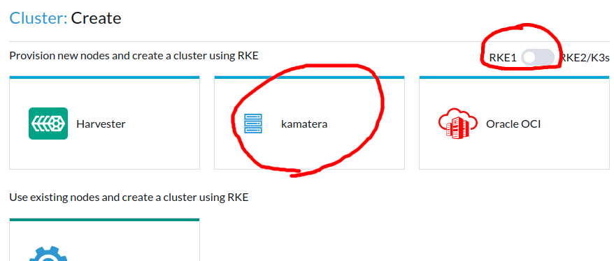

# Create a Kubernetes Cluster

## Node Templates

Rancher web-ui -> Cluster Management -> RKE1 Configuration -> Node Templates

If you created a single Rancher server using the Kamatera Rancher app you should already have node templates with the
minimal requirements. You may wish to edit or add node templates depending on your requirements.

Following table describes the available Kamatera node template fields:

| Field | Description | Required? |
| ----- | ----------- | --------- |
| apiClientId | Kamatera API Client ID with full permissions to create and manage servers | yes |
| apiSecret | Kamatera API Secret related to the provided apiClientId | yes |
| datacenter | Kamatera datacenter code to create the server in, e.g. `EU` - Create server in Europe datacenter | yes |
| image | Kamatera image, recommended to use `ubuntu_server_20.04_64-bit_optimized` | yes |
| cpu | CPU Specification comprised of number of cores and type of CPU, e.g. `2B` - 2 cores of standard CPU type, see https://console.kamatera.com/pricing for available CPU types | yes |
| ram | RAM size in MB, e.g. `2048` - 2GB, bear in mind that some of the RAM is used for the Kubernetes and Rancher services | yes |
| diskSize | The size of the primary disk in gb, e.g. `50` - 50gb | yes |
| privateNetworkName | Name of private network to attach server to, e.g. `lan-466538-my-lan` | no |
| privateNetworkIp | If privateNetworkName is provided, this allows to specify the IP address of the server in the private network, recommended not to specify and leave empty to auto assign an IP | no |
| extraSshkey | Public SSH Key to add to server authorized keys | no |
| billing | `hourly` or `monthly` | yes |
| traffic | If server billing is monthly, this allows to specify the monthly traffic package | no |
| script | Script to run on server after it is created | no |

Recommended configurations:

* controlplane:
  * 3 nodes, each with 4 CPU, 4GB RAM, 100GB disk size
* worker:
  * 3 nodes, each with 4 CPU, 8GB, 200GB disk size

## Create cluster

Rancher web-ui -> Cluster Management -> Clusters -> Create

On the top-right, switch to RKE1 cluster type and choose Kamatera

On the next page, fill in the following fields:

* cluster name: choose a unique name
* controlplane node pool:
    * name prefix: `(CLUSTER_NAME)-controlplane-`
    * count:
        * 1 node - cheaper but less options for recovery in case of problems, no high-availability
        * 3 nodes - high availability, recovery in case of problems
    * check etcd and controlplane checkboxes, leave the `worker` checkbox unchecked
* worker node pool:
    * name prefix: `(CLUSTER_NAME)-worker-`
    * count: depends on expected usage
    * check only the worker checkbox
* keep all default options
* create

## Check cluster creation progress

Click on the created cluster name under Cluster Management -> clusters.

Click on nodes to see the nodes and progress of creation.

You may see some errors but they usually go away in a few minutes once cluster stablizes.

Rancher has a retry mechanism, so even if there are errors, it will retry until it works.

If cluster is not stabilizing, check the rancher logs by SSH to the Rancher server and running `docker logs -f rancher`
